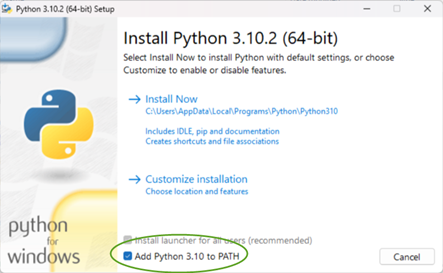
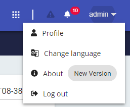
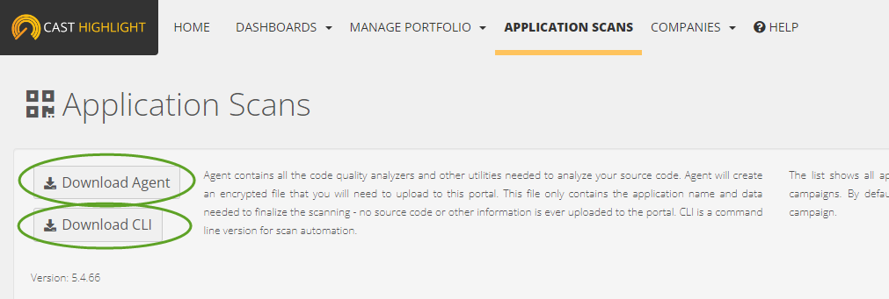
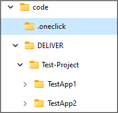
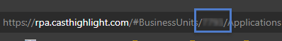

CAST OneClick

# OneClick Prerequisites

Running OneClick requires access to:

-   AIP Console
-   Highlight
-   REST API
-   Database

In addition, it requires the installation and location the Console and Highlight automation tools. This software is available either on the CAST Extend website or Highlight portal. These common configuration is stored in a special configuration file, “config.json” found in the \<base folder location\>/.oneclick folder.

# 

# OneClick Installation

1.  [Download Python \| Python.org](https://www.python.org/downloads/) (if not already done).
    -   The tool was tested using python version 3.10
    -   When installing python be sure to check the “Add Python to Path option”
2.  Place the OneClick zipped nugget file on your local machine (C Drive preferably).
3.  Create an empty base folder (name as desired) on your local machine.
    -   This folder will hold all the automatically created files by OneClick.
4.  Expand the nugget file into a folder, using zip.
5.  Open a command prompt, hold down windows key and press r, then type cmd enter.
6.  Using command prompt go to the folder containing the expanded nugget file.Type: install \<base folder location\>
    -   The base folder location will hold all files used and/or created by the OneClick tool.
    -   For more on this see the Environment section below.

# Common Configuration Requirements

To run oneClick requires access to AIP Console, Highlight, REST API and Database. In addition, it requires the installation and location the Console and Highlight automation tools. This software is available either on the CAST Extend website or Highlight portal. These common configuration is stored in a special configuration file, “config.json” found in the \<base folder location\>/.oneclick folder.

## AIP Console

OneClick requires AIP Console to run the MRI analysis. It has been tested using both 1.x and 2.x Enterprise version of Console. OneClick uses AIP Console integration tools to communicate with Console. AIP Console requires that the integration tools and Console versions match. Both can be downloaded from the CAST Extend Website at:

-   [Console Enterprise Edition](https://extend.castsoftware.com/#/extension?id=com.castsoftware.aip.console&version=1.28.2-funcrel)
-   [AIP Console integration tools](https://extend.castsoftware.com/#/extension?id=com.castsoftware.uc.aip.console.tools&version=1.0.1)

Once installed the OneClick config.json file should be updated to include the AIP Console and integration tools information. The default configuration file can be updated using the oneClick config option as follows:

oneClick config -b c:\\code

\--consoleURL=http://\<server-name\>:\<console-ip\>

\--consoleKey=\<console-key\>

\--consoleCLI=\<console-integration-tool-location\>

-   consoleURL is used to access AIP Console, the URL must match what is used to access the console
-   consoleKEY is the equivalent of a username and password. To obtain the key login to AIP console and click on the twisty next to your username, from the menu choose “Profile”. This will launch the profile page where a key can be generated.
-   consoleCLI is an extension used to access and remotely control AIP Console. This parameter must be an absolute location to the “aip-console-cli.jar” file included with the extension.

## Highlight

To analyze and upload an application to the Highlight portal two tools must be installed, the Highlight Agent and Command Line Interface (CLI). Both are found in the Highlight portal on the Application Scans page.

Once installed the OneClick default configuration file should be updated as follows:

oneClick config -b c:\\code

\--hlURL=\<portal-url\>

\--hlUser=\<username\>

\--hlPassword=\<password\>

\--hlInstance=\<Instance-ID\>

\--hlCLI=\<CLI-location\>

\--HLPerlInstallDir=\<agent-location\>/strawberry/perl\>

\--HLAnalyzerDir=\<agent-location\>/perl

-   hlURL – There are currently four URL’s used to access Highlight, https://rpa.casthighlight.com, https://app.casthighlight.com, <https://cloud.casthighlight.com> and custom inhouse depending on where the license was obtained from.
-   hlUser – the user Id used to access Highlight
-   hlPassword
-   hlCLI
-   HLPerlInstallDir
-   HLAnalyzerDir

# Environment

OneClick is designed to perform a due diligence assessment from beginning to end for one or more applications in a project. This includes:

1.  Code discovery
2.  Run CAST MRI Analysis
3.  Run CAST Highlight Analysis
4.  Generate Action Plan
5.  Generate Due Diligence Assessment Report

To work properly the tool will need access to CAST AIP Console, CAST Highlight Rest API, Highlight Agent, Highlight CLI, and CAST MRI Rest API. The tool expects the working folder structure to be:

-   code is the base folder referred to in the --baseFolder parameter.
-   .oneclick is generated by the tool containing all of the project configuration files.
-   DELIVER holds all the delivered code organized by project and application. The tool is expecting one folder for each application, this name will be used to represent the application going forward.

# Running the tool

## Command Line Arguments

OneClick has two types of arguments, the first are used to run the tool and the second to update the project configuration file. To properly run the tool, it requires a JSON file to be configured for each project. This file can be manually configured or using the tool.

### Parameters

Configuration Parameters fall into five categories, AIP, AIP Console, Highlight, Database and Settings. In addition, there are two required parameters, -b and -p. These parameters are used to identify the project and location the deliver folder.

Required Parameters:

| Name             | Example | Description                                                                                               |
|------------------|---------|-----------------------------------------------------------------------------------------------------------|
| -b --baseFolder  | D:/code | The location of the folder containing the deliver folder                                                  |
| -p --projectName | None    | The name of the project being worked on. (This field must match one of the folders in the deliver folder) |
| --config         |         |                                                                                                           |

AIP REST API Parameters:

| Name          | Example                     | Description                                                                                                                 |
|---------------|-----------------------------|-----------------------------------------------------------------------------------------------------------------------------|
| --aipURL      | http://localhost:8087/rest/ | The --hlURL URL to the AIP REST API                                                                                         |
| --aipUser     | None                        | Username used access the REST API                                                                                           |
| --aipPassword | None                        | Password used to access the REST API. This password will be encrypted before being added to the project configuration file. |

AIP Console:

| Name          | Example                | Description                                                                                                                                      |
|---------------|------------------------|--------------------------------------------------------------------------------------------------------------------------------------------------|
| --consoleURL  | http://localhost:8081/ | The AIP Console URL                                                                                                                              |
| --consoleKey  | None                   | The console key is to access AIP Console and treated like a password. It will be encrypted before being added to the project configuration file. |
| --consoleCLI  | None                   | The location of the “aip-console-tools-cli.jar”                                                                                                  |
| --consoleNode | None                   | The default node to run the application on                                                                                                       |

Highlight:

| Name               | Example                                                       | Description                                                                                                                                                |
|--------------------|---------------------------------------------------------------|------------------------------------------------------------------------------------------------------------------------------------------------------------|
| --hlURL            | https://rpa.casthighlight.com/WS2/                            | The URL to the Highlight REST API                                                                                                                          |
| --hlUser           | None                                                          | Username used access Highlight                                                                                                                             |
| --hlPassword       | None                                                          | Password used to access Highlight. This password will be encrypted before being added to the project configuration file.                                   |
| --Instance         | None                                                          | The Highlight project instance id. This id can be obtained from the URL of the “Manage Applications” page.  |
| --HLPerlInstallDir | HighlightAgent/strawberry/perl                                | Highlight comment line requirement – see Highlight documentation for more information                                                                      |
| --HLAnalyzerDir    | HighlightAgent/perl                                           | Highlight comment line requirement                                                                                                                         |
| --consoleCLI       | D:\\\\Highlight-Automation-Command\\\\HighlightAutomation.jar | The location of the highlight command line utility jar file                                                                                                |

Settings:

| Name          | Example | Description |
|---------------|---------|-------------|
| --companyName |         |             |
|               |         |             |
