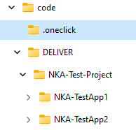

# What is OneClick
OneClick is a powerful automation tool for running a full due diligence assessment for multiple applications. Its range of capabilities includes locating the code, performing CAST MRI and Highlight Analyses, and generating a comprehensive Due Diligence Assessment Report.

This includes:

1.  Code discovery
2.  Run CAST MRI Analysis
3.  Run CAST Highlight Analysis
4.  Generate Action Plan
5.  Generate Due Diligence Assessment Report


To work properly the tool will need access to CAST AIP Console, CAST Highlight Rest API, Highlight Agent, Highlight CLI, and CAST MRI Rest API. The tool expects the working folder structure to be:



-   code is the base folder referred to in the --baseFolder parameter.
-   .oneclick is generated by the tool containing all of the project configuration files.
-   DELIVER holds all the delivered code organized by project and application. The tool is expecting one folder for each application, this name will be used to represent the application going forward.

## Installing the tool

## Installation
1.  Download the OneClick extension from the CAST Extend website.
2.  Extract the contents of the nugget file into a folder using a zip extraction tool.
3.  Right-click on the **install.bat** file and select "Run as administrator".
    * The base folder location will hold all files used and/or created by the OneClick tool.
    * For more on this see the Environment section below.

# Command Line Arguments

OneClick has two types of arguments, the first is used for both project and global configuration. Once the configuration is complete the second argument type is used to run the application analysis and generate the assessment report.

```
oneClick config -b <base location> [-p <project name>] 
		or
oneClick run -b <base location> -p <project name>
```

## Project Configuration Files

Configuration files are stored in the **\<base folder location\>/.oneclick** folder, created during installation. There are two types, global and project. The common configuration file, config.json, contains information common to all applications. When a new project is created the tool incorporates all global configuration items into the project specification configuration.

## Configuration Settings

### AIP Console

Oneclick has been tested using both 1.x and 2.x Enterprise version of AIP Console. The *AIP Console integration tools* is used to access the Console which can be downloaded:

-   [Console Enterprise Edition](https://extend.castsoftware.com/#/extension?id=com.castsoftware.aip.console&version=1.28.2-funcrel)
-   [AIP Console integration tools](https://extend.castsoftware.com/#/extension?id=com.castsoftware.uc.aip.console.tools&version=1.0.1)

Make sure the **integration tools** and **AIP Console** version matches. After both are installed update the common configuration file:

```
oneClick config -b <base location> [-p <project name>] --consoleURL=http:\\<server>\ --consoleKey=<console-key> --consoleCLI=<console-integration-tool-location> --enable-security-assessment <true> --blueprint <true>
```

| Parameter                  | Description                                                                                                                                    |                                                                                                                                |
|----------------------------|------------------------------------------------------------------------------------------------------------------------------------------------|--------------------------------------------------------------------------------------------------------------------------------|
| consoleURL                 | The URL of AIP Console                                                                                                                         |                                                                                                                                |
| consoleKEY                 | The console key provides access to the AIP Console and is retrieved from the user profile.                                                     |  |
| consoleCLI                 | The absolute location of the “aip-console-cli.jar” included with *AIP Console integration tools*                                               |                                                                                                                                |
| enable-security-assessment | This is a Boolean parameter, if set to true the analysis will be run with security turned on. The default setting for this parameter is True.  |                                                                                                                                |
| blueprint                  | This is a Boolean parameter, if set to true the analysis will be run in full blueprint mode. The default setting for this parameter is True.   |                                                                                                                                |

### Highlight

To run Highlight scans both the Agent and CLI tool must be installed. The can be downloaded from the **Application Scans** page in the Highlight portal.

To run Highlight scans and upload them to the portal, both the Agent and CLI tool must be installed. They can be downloaded from the Application Scans page in the Highlight portal. 

```
oneClick config -b <base location> [-p <project name>] --hlURL=<portal-url> --hlUser=<username> --hlPassword=<password> --hlInstance=<Instance-ID> --hlCLI=<CLI-location> --HLPerlInstallDir=<agent-location>/strawberry/perl> --HLAnalyzerDir=<agent-location>/perl
```

| Parameter   | Description                                                       |
|-------------|-------------------------------------------------------------------|
| hlURL       | The Highlight portal URL                                          |
| hlUser      | User Id                                                           |
| hlPassword  | Password                                                          |
| hlCLI       | Absolute folder location for the Highlight command line interface |
| HLAgent     | Absolute folder location for the Highlight agent                  |

### Imaging Rest API

The AIP Rest API is part of the Health and Engineering Portal (HDED) installation and is used to generate the assessment report. There are two distinct portal versions Standalone and Integrated and OneClick will work with both. The REST API configuration is as follows:

```
oneClick config -b <code location> [-p <project name>] --aipURL <URL> --aipUser <username> --aipPassword <password>
```

| Parameter    | Description            |
|--------------|------------------------|
| aipURL       | The Imaging portal URL |
| aipUser      | User Id                |
| aipPassword  | Password               |

### Other

```
oneClick config -b <code location> [-p <project name>] [--java_home <java>] --report_template <template> [cloc_version <cloc-1.96.exe>]
```

| Parameter       | Description                                                                                                                                                     |
|-----------------|-----------------------------------------------------------------------------------------------------------------------------------------------------------------|
| java_home       | Location of the java installation. This parameter can be omitted if the java bin folder is already part the system path.                                        |
| report_template | The absolute location of the assessment report template.                                                                                                        |
| cloc_version    | The cloc executable is located in the scripts folder and is set by default to cloc-1.96.exe. A new executable name can be added here to override this version.  |
=======
Note:
> Alterations to AIP Council Version 2 have caused the Assessment Report Generator to no longer operate with the Integrated Dashboard. To bypass this issue, you should switch to the Standalone Dashboard.

<a name="AIPcompatibility"></a>
# CAST AIP versions compatibility

This extension is compatible with **all AIP versions from 8.3.3** and above, and will be also in future versions.

<a name="expect"></a>
# Expected results

1. Code discovery
1. Run CAST MRI Analysis
1. Run CAST Highlight Analysis
1. Generate Due Diligence Assessment Report

For additional details on OneClick, please visit the  [OneClick Wiki](https://github.com/CAST-Extend/com.castsoftware.uc.oneclick/wiki).

<a name="KnownIssues"></a>
# Known issues

- Alterations to the Imaging Console Version 2 have caused the Assessment Report Generator to no longer operate with the Integrated Dashboard. To bypass this issue, you should switch to the Standalone Dashboard.

<a name="Limitations"></a>
# Limitations and potential enhancements

- None
